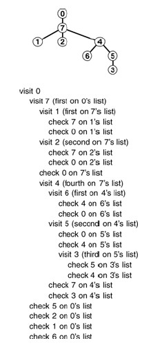
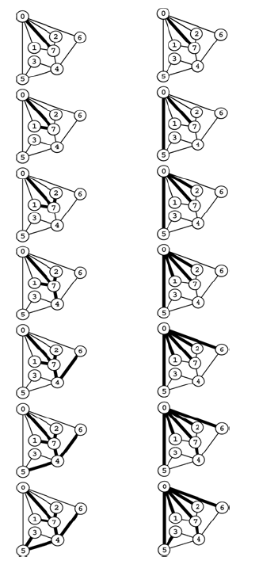
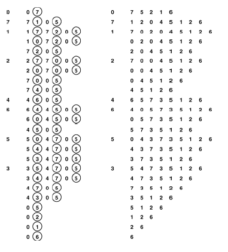

## Graph Traversal

we will study DFS here which is direct generalization of tree-traversal methods that we considered as of now. It also serves basic algorithm for processing graph

Starting at any node `v` , we

- Visit v
- (recursively) visit each( unvisited) node attached to v.

if graph is connected we will eventually reach all node

Stack calls in dfs for a adjacency list representation for graph.



**DFS vs BFS**



Note: *The difference between dfs and general tree traversal is that we need to guard explicitly against visiting nodes that we have already visited.*

In a tree we won't encounter any such nodes.

*if graph is tree then preorder traversal is equivalent to dfs*

***Property : DFS requires time proportional to `V+E` in a graph with V vertices and E edges, using the adjacency list representation.***

````c++
void traverse( int k , void visit (int)){
    visit(k); visited[k] = 1;
    for(link t= adj[k];t!=0;t=t->next)
        if(!visited[t->v]) traverse(t->v,visit);
}
````

Since it takes time proportional to V+E to build this graph.

dfs gives linear time solution to connectivity problem.

Note : *For huge graphs we prefer union-find because it takes space proportional to V while dfs takes E*

**DFS Stack Dynamics**

pushdown stack supporting dfs as containing a node and a reference to that node's adjacency list(indicated by a circle node)(left). Thus, we begin with node 0 on the stack, with reference to the first node on its list, node 7.

Each line indicates the result of popping the stack for node that have not been visited.

Alternatively, we can think of the process as simply pushing all nodes adjacent to any unvisited node onto the stack(right)



Right side depicts the stack containing link to node only. We visit head then push all the adjacent elements onto the stack.

### BFS

To visit all the nodes connected to node k in graph, we put k onto a FIFO queue,then enter into a loop where we get the next node from the queue, and if it has not been visited, visit it and push all the unvisited nodes on its adjacency list, continuing until the queue is empty.

````c++
void traverse(int k, void visit(int) ){
    queue<int> q(V*V);
    q.push(k);
    while(!q.empty()){
        if(visited[k = q.top()] == 0){
            visit(k); visited[k] = 1;
            for(link t= adj[k] ; t!=0 ; t= t->next)
                if(visited[t->v] == 0) q.push(t->v);
        }
    }
}
````

