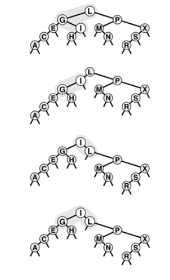
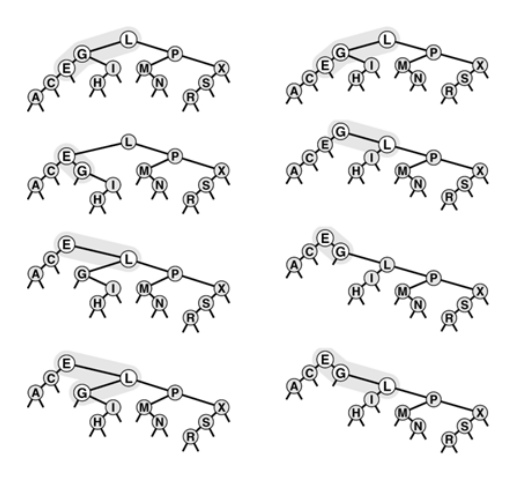

### Splay BSTs

We have seen how to put new node at the root using left/right rotation now we will modify root insertion such that the rotations balance the tree in a certain sense, as well.

rather than considering one rotation consider two rotation s.t. it brings a node from a position as one of grandchildren of the root up to the top of the tree.

First rotation makes it child of root and then second rotation brings it to the root. There are 2 cases depending on whether two links from the root to node being inserted are oriented in the same way or different way.

**Double rotations in a BST (diff. orientations)**

a left rotation at G followed by right rotation at L brings I to root(bottom).



**Double rotation in a BST (orientation alike)**

here we have 2 options to choose. With standard root insertion method we perform the lower rotation first; with splay insertion, we perform higher rotation first (right).



The BSTs built this way are splay BSTs. While difference between splay and standard root insertion may seem inconsequential, but it is quite significant : the splay operation eliminates the quadratic worst case that is the primary liability of standard BSTs.

*Property 4* The number of comparisons used when a splay BST is built from N insertions into an initially empty tree is $O(N\lg N)$ 

There are 4 possibilities for two steps of the search path from the root and performs the appropriate rotations

1. left-left : Rotate right at the root twice
2. left-right : Rotate left at the left child, then right at the root
3. right-right : Rotate left at the root twice
4. right-left : Rotate right at the right child, then left at the root.

**Splay insertion in the BSTs**

````c++
private:
	void splay(link& h, Item x)
    {
        if(h==0)
        { h = new node(x,0,0,1); return;}
        if(x.key() < h->item.key())
        { link& hl = h->l; int N = h->N;}
        if (hl == 0)
        { h = new node(x,0,h,N+1); reutrn;}
        if(x.key() < hl->item.key())
        	{ splay(hl->l,x); rotR(h);}
        else { splay(hl->r,x); rotL(hl);}
        rotR(h);
    }
	else
    {
        link &hr = h->r ; int N = h->N;
        if(hr ==0)
        	{ h = new node(x,h,0,N+1); return;}
        if( hr->item.key() < x.key())
       		{ splay(hr->r,x); rotL(h);}
        else { splay(hr->l,x); rotR(hr);}
        rotL(h);
    }}
public:
	void insert(Item item)
    { splay(head, item); }
````

*Property :* The number of comparisons required for any sequence of M insert or search operations in an N-node splay BST is O((N+M) lg (N+M))

Small number of searches improves the tree balance substantially.

