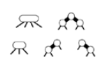
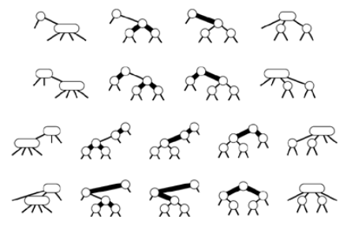

### Red-Black Trees

The top-down 2-3-4 insertion algorithm is very easy to understand but hard to implement. Here we explore a simple abstract representation of 2-3-4 trees that guarantee near optimal worst-case performance and relatively easy to implement.

The basic idea is to represent 2-3-4 trees as standard BSTs (2-nodes only), but to add one extra bit of information per node to encode 3-node and 4-nodes.

We think of links as being of two different types :

1. *Red Links* which bind together smaller binary trees comprising of 3-nodes and 4-nodes,
2. *Black links* which bind together the 2-3-4 tree.



represent 4 nodes as three 2-nodes connected by red link. and 3-nodes as two 2-nodes connected by a single red link. The red can be on either side.

We use red links for internal connections in 2-3-4 trees while use black links for the tree links.

In any tree, each node is pointed to by one link, so colouring the links is equivalent to colouring the nodes. Accordingly, we use one extra bit per node to store the colour of the links pointing to that node.


Red-black trees have two essential properties

- the standard search method for BSTs work without modification
- they directly correspond to 2-3-4 trees, so we can implement the balanced 2-3-4 tree algorithm by maintaining correspondence.

We get best of both worlds i.e. simple search method from the standard BST, and the simple insertion-balancing method from the 2-3-4 search tree.

The search method has to never examine the color of link so it doesn't add to the search procedure moreover the overhead of insertion is small we have to take action for balancing only when we see 4-nodes and there are not many 4-nodes in the tree because we are always breaking them.

If we have a 2-node connected to a 4-node, then we should convert the pair into a 3-node connected to two 2-node; if we have a 3-node connected to a 4-node, then we should convert the pair into a 4-node connected to two 2-node. When a new node is added at the bottom, we imagine it to be a 4-node that has to be split and its middle node passed up to be inserted into the bottom node where the search ends, which is guaranteed by top-down process to be either a 2-node or 3-node.

<u>Splitting 4-nodes in a red-black tree</u>

splitting a 4-node which is not the child of a 4-node by changing the node colors in the three nodes comprising the 4-node, then possible doing one or two rotations.

If the parent is 2-node or 3-node that has convenient orientation *(second from top)*, no rotations needed. If 4-node is on the center link of the 3-node (*Bottom*), a double rotation is needed otherwise, a single rotation suffices (*third from top*)..



Fortunately, the rotation operations that we have been using are precisely what we need to achieve the desired effect.

**Insertion in red-black BSTs**

````c++
private:
	int red(link x)
    { if (x==0) return 0; return x->red;}
	void RBinsert(link& h,Item x, int sw)
    {
        if(h==0) { h = new node(x); return; }
        if( red(h->l) && red(h->r))
        { h->red = 1; h->l->red = 0; h->r->red = 0; }
        if(x.key() < h->item.key())
        {
            RBinsert(h->l,x,0);
            if(red(h) && red(h->l) && sw) rotR(h);
            if(red(h->l) && red(h->l->l))
            { rotR(h); h->red = 0; h->r->red = 1;}
        }
        else
        {
            RBinsert(h->r,x,1);
            if(red(h) && red(h->r) && !sw) rotL(h);
            if(red(h->r) && red(h->r->r))
            { rotL(h); h->red = 0; h->l->red = 1;}
        }
    }
public:
	void insert(Item x)
    { RBinsert(head,x,0); head->red = 0;}
````

*Property 1 :* A search in a red-black tree with N nodes requires fewer than $2\lg N +2$ comparisons.

*Property 2 :* A search in a red-black tree with N nodes built from random keys uses about $1.002 \lg N$ comparisons, on the average.

*Property 3 :* A red-black BST is a binary search tree in which each node is marked to be either red or black, with additional restriction that no two red nodes appear consecutively on any path form an external link to the root.

*Property 4 :* A balanced red-black BST is a red-black BST in which all paths from external links to the root have same number of black nodes.

For an application that carries other information in trees, the rotation operation might become expensive perhaps we have to update the information in all nodes in the subtrees involved. For such an application we can ensure that each insertion involves at most one rotation by using red-black trees to implement the bottom up 2-3-4 search trees.

if duplicate keys are to be maintained in tree, then as we did in splay BSTs, we must allow items with keys equal to a given node to fall on both sides of that node. Otherwise severe imbalance could result from long strings of duplicate keys.

The oldest and most well-known data structure for balanced trees is the height balanced, or AVL, tree discovered in 1962 by Adel'son, Vel'skii and Landis. These trees have property that the height of two subtree of each node differ by at most 1. If an insertion causes one of the subtree of some node to grow in height by 1, then the balance condition might be violated.

However , one single or double rotation will bring the node back into balance in every case.