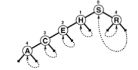
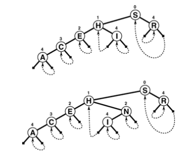

### Patricia Tries

Tries search have 2 inconvenient flaws.

1.  the one-way branching leads to creation of extra nodes in trie.
2. there are two different types of nodes in the trie, which leads to complications.

In 1968, Morrison discovered a way to avoid these problems, in a method he called *Patricia*. ("practical algorithm to retrieve information coded in alphanumeric")

Like DSTs, Patricia tries allow search for N keys in a tree with just N nodes; like tries, they require only about $\lg N$ bit comparisons and one full key comparison per search, and they support other ADT operations. Moreover, these performance characteristics are independent of key length, and the data structure is suitable for variable-length keys.

Starting with the standard trie, we avoid one-way branching via a simple device : we put each node the index of the bit to be tested to decide which path to take out of that node. Thus, we jump directly to the bit where a significant decision is to be made, bypassing the bit comparisons at nodes where all the keys in the subtree have the same bit value.

Moreover, we avoid external nodes via another simple device: we store data in internal nodes and replace links to external nodes with links that point back upward to correct internal node in the trie.

With patricia tries, we store keys in nodes as with DSTs, and we traverse the tree according to bits of search key, but we do not use the keys in the nodes on the way down the tree to control the search; we merely store them there for possible later reference, when the bottom of the tree is reached.

#### Explanations of Patricia Search

//== Best refer book :-)





Above 2 figure show how to insert the I and N into the patricia trie.

**Patricia-trie search**

````c++
private:
	Item searchR(link h, Key v, int d)
    {
        if(h->bit <= d) return h->item;
        if(digit(v, h->bit) == 0)
            return searchR(h->l, v, h->bit);
        else return searchR(h->r, v, h->bit);
    }
public:
	Item search(Key v)
    {
        Item t = searchR(head, v, -1);
        return (v == t.key()) ? t : nullItem;
    }
````

A patricia-trie search key always ends with a key comparison, and this key carries the information that we need. We find the leftmost bit position where the search key and the key that terminated the search differ, then search through the trie again, comparing that bit position against the bit position in the nodes on the search path.

If we come to a node that specifies a bit position higher than the bit position that distinguishes the key sought and key found, then we know that we skipped a bit in the patricia- trie search that would have led to a null link in corresponding trie search, so we add a new node for testing that bit.

If we never come to a node that specifies a bit position higher than the one that distinguishes the key sought and key found,  then the patricia trie search corresponds to a trie search ending in a leaf, and we add a new node that distinguishes the search key form the key that terminated the search.

**Patricia Trie Insertion**

````c++
private:
	link insertR(link h, Item x, int d, link p)
    {
        Key v = x.key();
        if((h->bit >= d) || (h->bit <= p->bit))
        {
            link t = new node(x); t->bit = d;
            t->l = digit(v,t->bit) ? h : t;
            t->r = (digit(v,t->bit) ? t : h);
            return t;
        }
        if(digit(v, h->bit) == 0)
            h->l = insertR(h->l, x, d, h);
        else h->r = insertR(h->r, x, d, h);
        return h;
    }
public:
	void insert(Item x)
    {
        Key v = x.key(); int i;
        Key w = searchR(head->l, v, -1).key();
        if( v==w ) return;
        for( i = 0; digit(v,i) == digit(w,i); i++);
        head->l = insertR(head->l, x, i, head);
    }
	ST(int maxN)
    {
        head = new node(nullItem);
        head-> l = head->r = head;
    }
````

**Patricia-trie sort**

````c++
private:
	void showR(link h, ostream& os, int d)
    {
        if(h->bit <= d) { h->item.show(os); return; }
        showR(h->l, os, h->bit);
        showR(h->r, os, h->bit);
    }
public:
	void show(ostream& os)
    { showR(head->l, os, -1); }
````

*Property :* Insertion or search for a random key in a patricia trie built from N random bitstrings requires about $\lg N$ bit comparisons on the average, and about $2\lg N$ bit comparisons in the worst case. The number of bit comparisons is never more than the length of the key.

