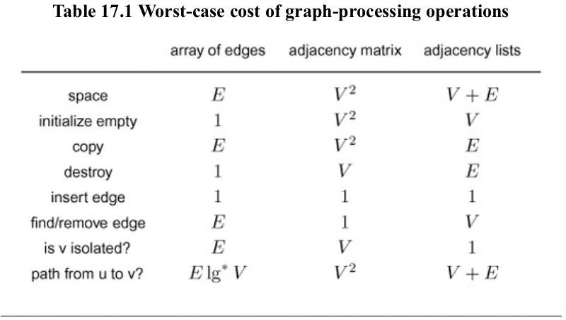

### Variations, Extensions, and Costs

Standard adjacency-lists representation for finding out all the edges coming into a vertex in a digraph.

For *weighted graphs and networks*, we fill adjacency matrix with information instead of boolean values; in the adjacency list representation we include this info in  adjacency-list elements.

Suppose we want to know whether vertex $v$ is isolated i.e. Is $v$ of degree 0. For adjacency-lists representation it quite easy to check whether list is empty and for matrix we check entire row/column but its quite hard in vector-of-edges representation.

 This implementation, after pre-processing the graph in time proportional to size of its representation, allows clients to find the degree of any vertex in constant time.

**17.11 Vertex-degree class implementation**

````c++
template <class Graph> class DEGREE
{
    const Graph &G;
    vector <int> degree;
    public:
    	DEGREE(const Graph &G): G(G),degree(G.V(),0)
        {
            for(int v = 0; v<G.V(); v++)
            { typename Graph::adjIterator A(G,v);
              for(int w = A.beg(); !A.end(); w=A.nxt())
              degree[v]++;
            }
        }
    int operator[](int v) const
    { return degree[v]; }
};
````



Removing vertices is more expensive than removing edges.

In undirected graph we need to remove it from the list on both the entries.

We can dramatically improve the performance of algorithms that process huge static graphs represented with adjacency lists by stripping down the representation to use vectors of varying length.

