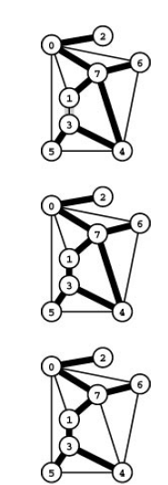

### Underlying Principles of MST Algorithms

One of the defining properties of a tree is that adding an edge to a tree creates a unique cycle. This property supplements proof of two important property of MSTs.

First property is *cut property*, it has to do with identifying edges that must be in an MST of a given graph. The few basic term from graph theory that we define next make possible a concise statement for this property.

**Definition 20.2** *A **cut** in a graph is a partition of the vertices into two disjoint sets. A ***crossing edge** is one that connects a vertex in one set with vertex in the other.*

**Property 20.1 (Cut Property)** *Given any cut in a graph, every minimal crossing edge belongs to some MST of the graph, and every MST contains a minimal crossing edge.*

If graph's edge weights are distinct, it has a unique MST; and cut property says that the shortest crossing edge for every for every cut must be in MST. When equal wts are there we have multiple minimal crossing edge.

Examples.

We use cut property as the basis for algorithms to find MSTs, and it also serves as *Optimality Condition* that characterizes MSTs.

The second property, which we refer to as the *cycle property*, has to with identifying edges that do not have to be in a graph's MST. That is if we ignore these edges we can still find an MST

**Property 20.2 (Cycle Property)** *Given a graph G, consider the graph $G'$ defined by adding an edge e to G. Adding e to an MST of G and deleting a maximal edge on the resulting cycle gives an MST of G'*

This cycle property also serves as basis for an optimality condition that characterizes MSTs, It implies that every edge in a graph that is not in a given MST is a maximal edge on the cycle that it forms with MST edges.

We use cut property to accept MST edges or cycle property to reject them and both serve as basis of MST algorithms. The only difference between algorithms is that how they approach efficiently in identifying cuts and cycles.

The first approach that we consider in great details forms MST by building one edge at a time.

**Property 20.3** *Prims's Algorithm computes an MST of any connected graph.*

Another approach is based on applying cycle property repeatedly. We add edges one at a time to putative MST, deleting the maximal edge of cycle. This receives less attention cause difficulty of maintaining a DS that support efficient implementation of "delete the longest edge on the cycle" operation.

The second approach to finding MST that process edges in order of their length, adding to the MST each edge that doesn't form cycle and stopping at $V-1$ edges. This method is known as *Kruskal's algorithm*

**Property 20.4** *Kruskal's algorithm computes an MST of any connected graph.*

The third approach to building MST is *Boruvka's algorithm.* The first step is to add to MST the edges that connect each vertex to its closest neighbor. If edge weights are distinct, this step creates a forest of MST subtrees.

Then we add to the MST the edges that connect each tree to a closed neighbor, and iterate the process until we are left with just one tree.

**Property 20.5** *Boruvka's algorithm computes the MST of any connected graph.*

We consider these algorithms in details and then move on to a more generalized algorithm where we begin with a forest of single-vertex MST subtrees and perform the step of adding to the MST a minimal edge connecting any two subtrees in the forest continuing until $V-1$ edges have been added and a single MST remains.

By cut property, no edge that causes a cycle need to considered for MST, since some other edge was previously a min edge crossing a cut between MST subtrees containing each of its vertices.

Prim's algorithm grows a single tree an edge at a time, with Kruskal's and Borukva's algorithm, we coalesce trees in a forest.

We will implement some high-level abstract operations :

- Find a minimal edge connecting two subtree
- Determine whether adding an edge would create a cycle
- Delete the longest edges on a cycle.

 As yet unsolved in the design and analysis of algorithms is the quest for a linear-time MST algorithm.

