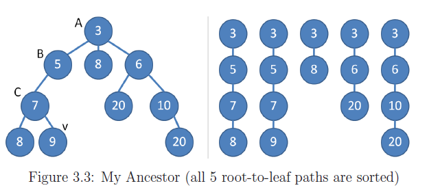
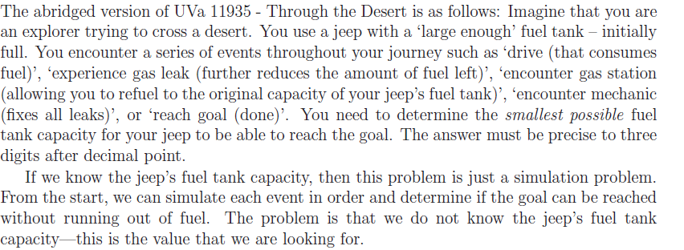
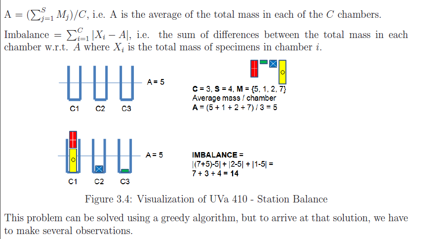
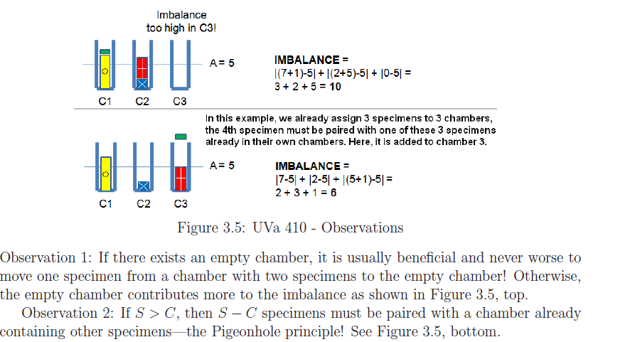
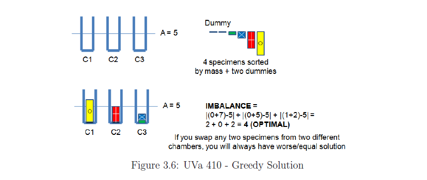
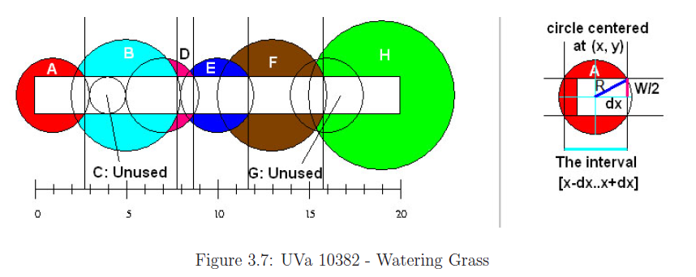

# Problem Solving Paradigms

- There are four problem solving paradigms
  - Complete Search
  - Divide and Conquer
  - Greedy Approach
  - Dynamic Programming

## Complete Search

- aka brute force or recursive backtracking

- in this method we traverse entire search space to obtain solution and during search we are allowed to prune

- Develop this solution only if

  - clearly no other algorithm available
  - better algorithms are overkill for input size

- Remember *'KISS'* - Keep it Short and Simple

- If there exists a better solution you will get a TLE

- This method can be used as a verifier for small instances

- #### Iterative Complete Search

  - Problem UVa 725 - Division (Two Nested Loops)
  - Problem UVa 441 - Lotto (Many Nested Loops)
  - Problem UVa 11565 - Simple Equations ( Loops + Pruning)
  - Problem UVa 11742 - Social Constraints( Permutations)
  - Problem UVa 12455 - Bars (Subsets)

- #### Recursive Complete Search

  - UVa 750 8 Queens Chess Problem

    This code basically checks for all different possibilities of proper non conflicting solution and checks whether given pair is part of the placement or not.

    It recursively does backtracking to save time.

    ````c++
    #include <cstdlib>
    #include <cstdio>
    #include <cstrings>
    using namespace std;
    
    int row[8] , TC , a , b, lineCounter;
    
    bool place(int r,int c){
        for (int prev=0; prev<c ; prev++)
            if(row[prev] == r || (abs(row[prev]-r) == abs(prev - c)))
                return false;
        return true;
    }
    void backtrack(int c){
        if(c==8 && row[b] == a){
            printf("%2d		%d", ++lineCounter , row[0]+1);
            for(int j=1;j<8; j++) printf(" %d",row[j] +1);
            printf("\n");     }
        for (int r =0; r< 8 ; r++)
            if(place(r,c)){
                row[c] = r; backtrack(c+1);
            }
    }
    
    int main(){
        scanf("%d",&TC);
        while(TC--){
            scanf("%d %d", &a,&b); a--;b--; //switching to zero basesd indexing
            memset(row,0,sizeof row); lineCounter = 0;
            printf("SOLN		COLUMN\n");
            printf(" # 		1 2 3 4 5 6 7 8\n\n");
            backtrack(0);	//generates all possible 8! candidates
            if (TC) printf("\n");
                } }
    ````

  - UVa 11195 (Another n-queen Problem)

- Tips

  - Filtering v/s Generating
  - Prune Infeasible Search Space Early
  - Utilize Symmetries
  - Pre-Computation
  - Try solving problem backwards
  - Optimize your Source Code
  - Use Better Data Structures & Algorithms

## Divide and Conquer

- Divide the original problem into sub-problems-(usually half)

- Find (sub)-solutions for each of these sub-problems-which are now easier

- If needed combine the sub solutions to get a complete solution for the main problem.

- #### Uncommon Usage of Binary search

  - #### The Ordinary Usage

    - canonical usage is searching a item in static sorted array.
    - complexity is $ O(logn) $ 
    - pre-requisite for performing a binary search can also be found in other uncommon data structures like-root-to-leaf path of a tree (not necessarily binary nor complete ) that satisfies *min heap property* .

  - #### Binary Search on Uncommon Data Structure

    - *Problem* Description - Given a weighted (family) tree of up to $N ≤
      80K $vertices with a special trait: Vertex values are increasing from root to leaves. Find the ancestor vertex closest to the root from a starting vertex $v$ that has weight at least $ P$.
      There are up to $Q ≤ 20K$ such offline queries. Examine Figure 3.3 (left). If $P = 4$, then the answer is the vertex labeled with $B$ with value $5$ as it is the ancestor of vertex v that is closest to root ‘$A$’ and has a value of $≥ 4$. If $P = 7$, then the answer is ‘$C$’, with value $7$.If $ P ≥ 9$, there is no answer.

      

      One way to solve is do linear search  $ O (QN) $ and since $Q$ is quite large this approach will give TLE.

      Better solution is to traverse once starting at the node using the $ O(N) $ preorder tree traversal algorithm.

      So we get these partial root-to-current-vertex sorted array:

      ***{{3}, {3, 5}, {3, 5, 7},{3, 5, 7, 8}, backtrack, {3, 5, 7, 9}, backtrack,backtrack, backtrack, {3, 8}, backtrack,{3, 6}, {3, 6, 20}, backtrack, {3, 6, 10}, and finally {3, 6, 10, 20}, backtrack, backtrack,
      backtrack (done)}.***

      Now we can use Binary search on these sorted arrays when we are queried.

  - ### **Bisection Method**

    -  this method can be used to find root of a function that maybe difficult to compute directly

    - UVA 11935 Problem-Through the Desert

      - 

        For the problem description, we can compute the range of possible answers between [0.00 .. 10000.000], with 3 digits of precision.

        However these are 10M possibilities. This will certainly give TLE.

        *Luckily problem has a property that we can exploit*. Suppose that the correct answer is $ X $ . Setting your jeep's fuel tank capacity to any  value between [0.000...X-0.001] will not bring jeep to safely to the goal event. On the other hand, setting your jeep fuel tank volume to any value between [X.... 10000.000] will bring you to goal.

      ````c++
      #define EPS 1e-9
      
      bool can(double f){	//simulation portion
          //return true if jeep reaches to its goal 
          //return false otherwise
      }
      //inside int main
      // Binary Search the answer, then simulate
      double lo =0.0, hi=1000.0, mid =0.0 ans =0.0;
      while(fabs(hi-lo)>EBS){
          mid = (lo+hi)/2.0;
          if(can(mid)) { ans = mid ; hi = mid;}
          else 			lo=mid;
      }
       printf("%.31f\n",ans);
      
      ````

      

## Greedy

- an algorithm that make the locally optimal choice at each step with the hope of eventually reaching the globally optimal solution.

- a problem to be solved using greedy must exhibit these two property

  - It has optimal sub structures
  - It has the greedy property (difficult to prove in time -critical environment)

- **Coin change**- the greedy version

  - 

  - This problem has two properties 

    - Optimal sub-structures

      These are

      - To represent 17 cents we use 10+5+1+1
      - To represent 7 cents we use 5+1+1

    - Greedy property- Given every amount V,we can greedily subtract the largest coin denomination which is not greater than this amount V. It can be proven that using any other strategies will not lead to an optimal solution, at least for this set of coin denominations.

  - However this greedy doesn't always work for all sets of coin denominations e.g. $\{4,3,1\}$ cents. To make 6 cents with this set will fail optimal solution.

- **Station Balance(Load Balancing)- UVa 410**

  - 

  - 

  - 

  - key insight is that this problem can be solved using sorting

  - if S<2C , add 2C - S dummy specimens with mass 0. for e.g. let C=3, S=4

    

    

- **Watering Grass- UVa 10382**-(**Interval Covering**)

  - 
  - Using brute force and calculating all possible combination is useless.
  - This is a classic Interval Covering problem (*a variant of greedy*) with little twist in geometry that subintervals are circle now. But we can calculate dx = sqrt(R^2^ - (W/2)^2^). Interval spanned is [x-dx..x+dx] with x as center.
  - 
  - The Greedy sorts the interval by *increasing* left endpoint and by *decreasing* right endpoint in case if ties arise. It takes the interval that covers 'as far as right as possible' and yet still produces uninterrupted coverage from the leftmost side to the rightmost side of the horizontal strip of the grass. It ignores intervals that are already covered by the (previous) intervals.

- **UVa - 11292 Dragon of Loowater (Sort the input first)** 

  - 

    This is a bipartite matching problem but still can be solved.

  - we match(pair) certain knights to dragon heads in maximal fashion. However, this problem can be solved greedily

  - Each dragon head must be chopped by a knight with the shortest height that is at least as tall as the diameter's of the dragon's head.

    However input is arbitrary order. Sorting Cost $ O (n\log n + m\log m) $;

    then to get answer $ O (min(n,m)) $

    ````c++
    gold = d = k = 0; // array dragon and knight sorted in non decreasing order
    while(d<n && k<m){
        while(dragon[d]> knight[k] && k<m) k++; //find required knight
        if(k==m) break;		//no knight can kill this dragon head,doomed
        gold+= knight[k]; // the king pays this amount of gold
        d++;k++;	//next dragon head and knight please
    }
    
    if(d==n) printf("%d\n",gold);		//all dragon heads arer chopped
    else printf("Loowater is doomed!\n");
    ````

  - Other classical examples are

    - Kruskal's(and Prim's) algorithm for the minimum spanning tree (MST)
    - Dijkstra's (SSSP)
    - Huffman Code
    - Fractional Knapsacks
    - Job Scheduling Problem

- ## Dynamic Programming

  - key skills needed to master
    - determine the problem *states*
    - determine the relationship or *transitions* between current problems and their subproblems.
  - often used to solve *optimization* problems and *counting* problems.

- **DP Illustration**

  -  